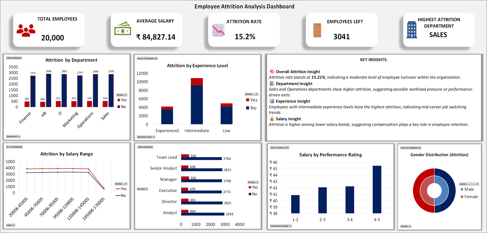

# 📊 Employee Attrition Analysis Dashboard (Excel)

## 📬 Author
Jatin singh

## 📷 Dashboard Preview

## 🔍 Project Overview
This project analyzes employee attrition using Excel. The dashboard provides insights into employee turnover, department trends, salary impact, and experience levels.

---

## 📌 Key KPIs
- Total Employees: 20,000
- Attrition Rate: 15.2%
- Employees Left: 3,041
- Highest Attrition Department: Sales

---

## 📊 Dashboard Features
- Attrition by Department
- Attrition by Experience Level
- Attrition by Salary Range
- Salary vs Performance Analysis
- Gender Distribution

---

## 💡 Key Insights
- Attrition is moderate (~15%)
- Sales & Operations have highest attrition
- Mid-level employees are leaving more
- Lower salary employees show higher attrition

---

## 🛠 Tools Used
- Microsoft Excel
- Pivot Tables
- Charts & Visualizations

---

---

---
